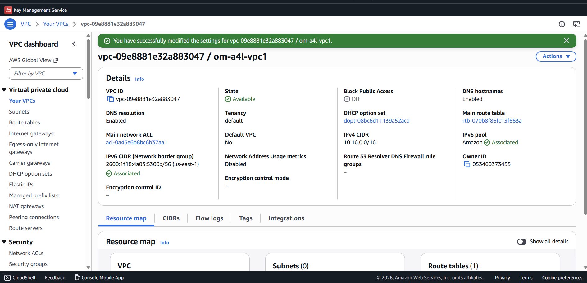
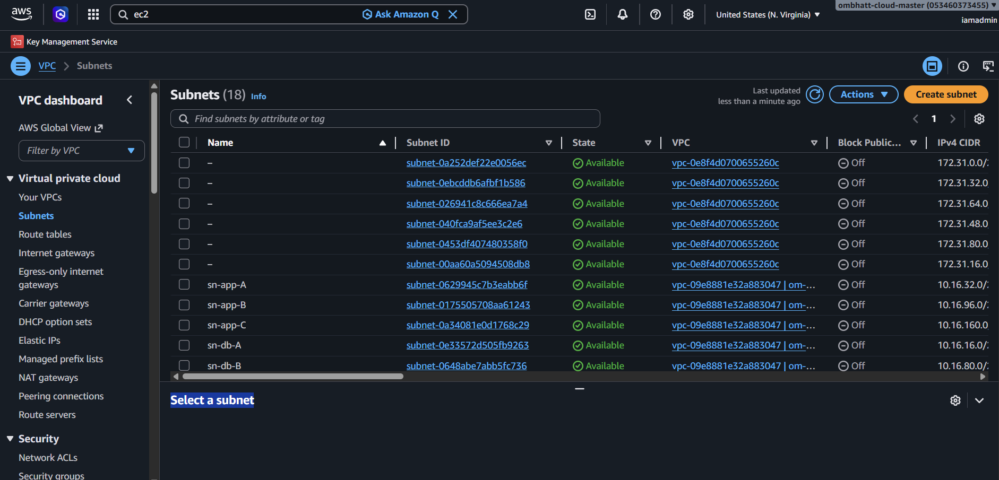

# AWS VPC Foundation Lab

## Objective
Built a custom multi-AZ VPC architecture manually in AWS.

## Implemented
- Custom VPC creation
- DNS hostname enablement
- IPv4 and IPv6 configuration
- Multi-tier subnet architecture
- Multi-AZ subnet deployment
- Reserved subnet planning

## VPC Configuration
- VPC Name: om-a4l-vpc1
- IPv4 CIDR: 10.16.0.0/16
- IPv6 Enabled
- DNS Resolution Enabled
- DNS Hostnames Enabled

## Subnet Architecture

### Availability Zone A
- sn-reserved-A → 10.16.0.0/20
- sn-db-A → 10.16.16.0/20
- sn-app-A → 10.16.32.0/20
- sn-web-A → 10.16.48.0/20

### Availability Zone B
- sn-reserved-B → 10.16.64.0/20
- sn-db-B → 10.16.80.0/20
- sn-app-B → 10.16.96.0/20
- sn-web-B → 10.16.112.0/20

### Availability Zone C
- sn-reserved-C → 10.16.128.0/20
- sn-db-C → 10.16.144.0/20
- sn-app-C → 10.16.160.0/20
- sn-web-C → 10.16.176.0/20

## Key Concepts Practiced
- Enterprise VPC CIDR planning
- Subnet segmentation
- Availability Zone resilience
- IPv6 subnet assignment
- Public vs private tier preparation

## Screenshots
- VPC overview
- Subnet architecture

## Additional Networking Configuration

### Internet Connectivity
- Created and attached an Internet Gateway (IGW)
- Configured a dedicated route table for web subnets
- Associated web subnets with public route table
- Added IPv4 default route (0.0.0.0/0) to IGW
- Added IPv6 default route (::/0) to IGW
- Enabled automatic public IPv4 assignment for:
  - sn-web-A
  - sn-web-B
  - sn-web-C

## Notes
The manually configured networking components were later removed in preparation for rebuilding the architecture using AWS CloudFormation automation.

